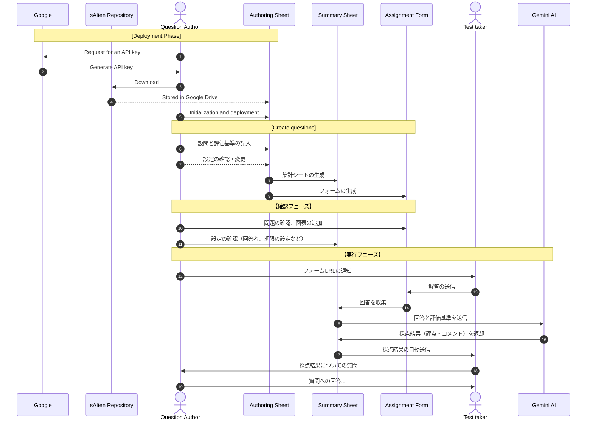

# sAIten
Templates and scripts for creating and administering AI-assessable quizzes for educational use

# Requirement
* Google account
* Gemini AI API Key

# Example Workflow (Personal ver.)

  

# Usage
1. Copy the [spread sheet]() to your GoogleDrive.

The sheet is 
\* For clear managing, I recommend create a new directory for saving quiz forms and score sheets of them.

1. Open the copied sheet and enter the information of your quiz and .

1. Select "" > "" menu from the menubar.

Now, two files 

1. Check the created form.

1. Open the created scoring sheet and select "" > "" menu to authorize your account.
During this step, you need to enter your Gemini AI API key for automatic scoring by AI.

1. Next, select "" > "" menu to authoriza your account for automatic sending scoring results to students.

\* The authorization steps for AI usage and sending emails are separated because  
Please run both the authorization steps.

1. (Optional) Edit the setting.

# Sample

