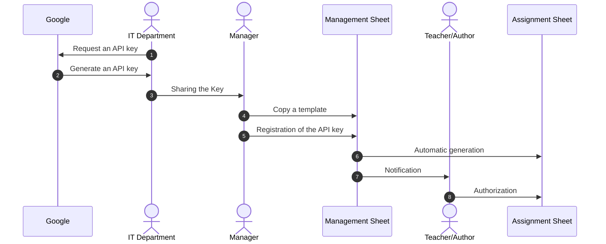
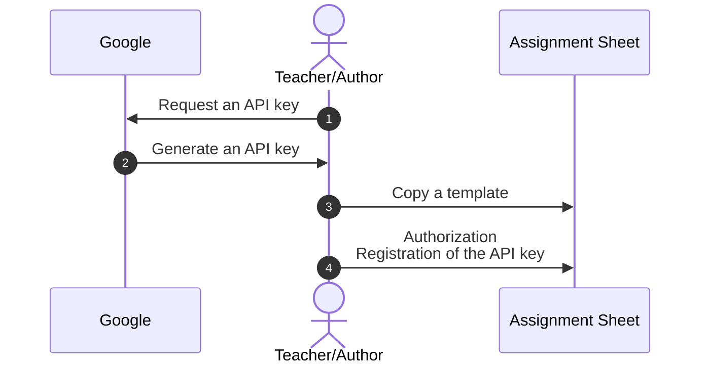
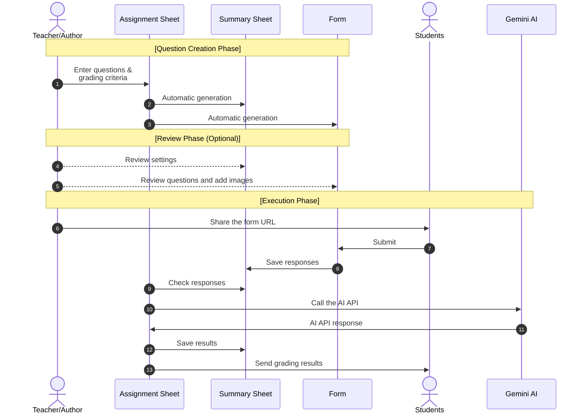

# sAIten
This system enables automatic grading of open-ended responses using AI (Gemini) by integrating Google Forms and Google Sheets.
It allows educators to conduct quick assessments and provide instant feedback with minimal manual effort.

## 🎓 Background and Purpose
In educational settings where the number of students far exceeds the number of faculty members, many instructors find themselves forced to rely solely on multiple-choice questions due to the overwhelming burden of grading open-ended responses.  
However, certain critical aspects of learning—such as the retention of specific knowledge, the depth of conceptual understanding, and the ability to explain complex ideas—can only be effectively verified and evaluated through descriptive, open-ended questions.  
By utilizing this system, instructors can easily implement descriptive tests and provide feedback to students simply by entering the problem statements and evaluation criteria (key learning points and point allocations) into a spreadsheet. Furthermore, the system can be configured so that instructors review the AI-generated grading results before they are returned to students, ensuring human oversight in the assessment process.  
As of 2026, it is no longer uncommon for students to use AI to generate "plausible-sounding" text. Consequently, it has become increasingly difficult to evaluate whether a student truly understands the material or possesses adequate explanatory skills based solely on reports submitted after a lengthy preparation period.  
This system makes it easy to monitor daily learning progress by requiring students to provide spontaneous descriptive answers during short intervals—such as five minutes during a lecture. Additionally, by setting a longer operation period, the system can function as a simplified practice tool, allowing students to review and check their own level of understanding before periodic examinations.  

## 🚀Features
  * Automated grading of descriptive answers using AI
  * Instant feedback returned to students
  * Seamless integration with Google Spreadsheet and Forms
  * Serverless operation using Google Apps Script (GAS)
  * Supports both individual and organizational use

## ⚙️ Flexible Control Options
  * Switch between automatic and manual feedback return
    => Instructors can review AI grading results before sending feedback
  * Select and switch AI models (Gemini)
    => It allows you to use advanced models depending on the difficulty and domain of the questions.
  * Control number of submission attempts and deadlines / availability period

## 📚 Documentation
### Detailed configuration options and usage are provided via [sAIten Help]()  

## 🔑 Requirement
  * Google account\*  
    Click [here](https://support.google.com/accounts/answer/27441?hl=en&co=GENIE.Platform%3DDesktop&oco=0) for instructions.  
  * Gemini AI API Key  
    This is a key that can be issued via [AI Studio](https://aistudio.google.com/).  
    If you do not already have one, please refer to the [guide](https://ai.google.dev/gemini-api/docs/api-key) to obtain an API key and save it.  
    
    \* Google Workspace for Education account is recommended.

## 👤 Usage Modes
  This system supports two types of usage:  
  ### 1. Individual Use
    For a single instructor creating and managing assignments independently.  
  ### 2. Organizational Use
    For institutions (schools, departments, etc.) where multiple instructors share a common system.  

## 📊 Provided Templates
  * [Assignment Creation Sheet (for individual use)]()
  * [Management Sheet (for organizational use)]()

## 🧑‍🏫 Individual Use Guide
### 1. Prepare the Sheet  
  * Open the publicly available [Assignment Creation Sheet]()  
  * Make a copy to your Google Drive  

### 2. Authorization  
  * Select "sAIten" > "Setting" > "Authorize"  
  This grants permissions for:  
    > Google Apps Script  
    > Google Drive file management  
    > Email sending  
    > External API access (fetch)  

### 3. Set API Key
  * Select "sAIten" > "Setting" > "Register API Key"  

### 4. Input Questions
  * Fill in the required fields in the sheet:  
    > Assignment title  
    > Number of questions  
    > Question text  
    > Evaluation criteria  
    > Score allocation  

### 5. Automatic Setup
  * From the custom menu, select "Generate Form and Summary Sheet"  
  This will automatically create and link:  
    > A Google Form  
    > A response spreadsheet  
  
  * The links to the generated files are saved in "" tab of the .

### 6. Operation
  * Share the submission form URL with students  
    Once responses are submitted, AI performs grading, and feedback is automatically sent to students.

## 🏫 Organizational Use Guide
### 1. Prepare the Management Sheet
  * Open the [Management Sheet]()  
  * Make a copy to your Google Drive  

### 2. Set API Key (Optional)
  * If you would like to use a shared API key across the organization:  
    > Set the Gemini API key in the management sheet  
      It will be shared with all registered instructors 

### 3. Register Instructors
  * Enter the following information:  
    > Instructor ID (e.g., employee number)  
    > Group (subject, grade, etc.)  
    > Instructor name  
    > Email address (Google account)

### 4. Generate Assignment Sheets
  * From the custom menu, select "Generate Assignment Sheets"  
  　An assignment creation sheet similar to the personal version will be created and shared with each instructor.  

### 5. Assignment Creation & Distribution
  * Each instructor creates assignments as in individual use
  * Share forms with students
  * Grading and feedback are handled automatically

## 💻 Workflow
### Setup For Organizational Use

### Setup For Personal Use

### Practical Use

## ⚠️ Notes  
  * AI grading may produce incorrect evaluations in some cases  
  * Poorly defined evaluation criteria may reduce grading accuracy  
  * API usage may incur costs depending on usage volume  

## 📜 License
This project is licensed under the MIT License.

## 📄 Citation
This work is currently under preparation for submission. A citation will be added in the future.