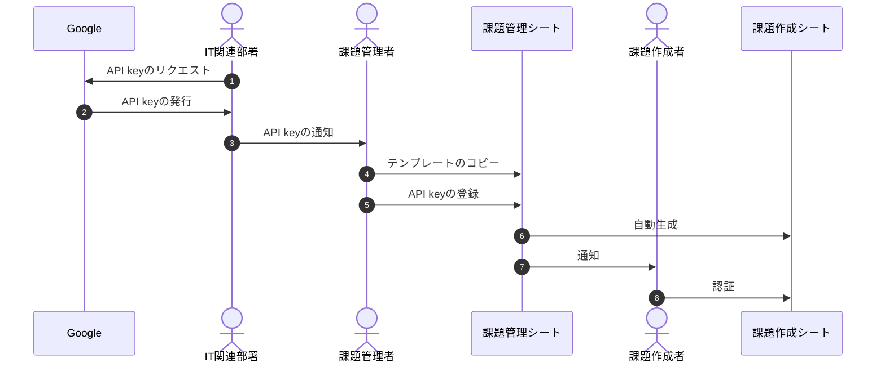
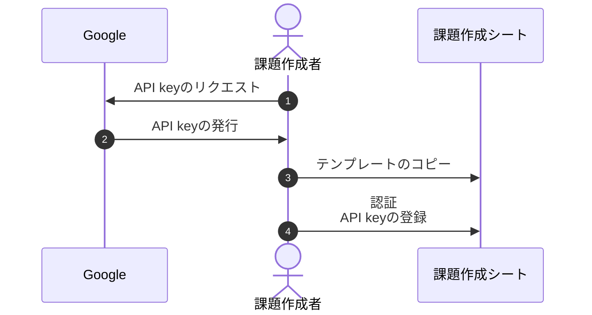
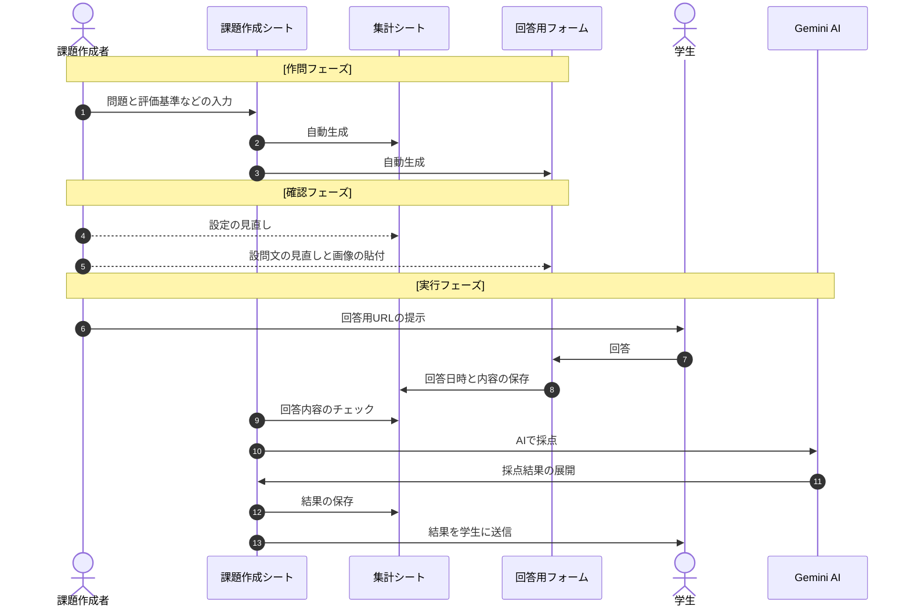

# sAIten
このシステムは、GoogleスプレッドシートとGoogleフォームを利用して、記述式の小テストの出題とAIによる採点、および採点結果のスコアとコメントを返却するまでの、一連の過程を自動かつ即時に行うものです。   
  
主な目的は、教員の負担を抑えながら、学生の理解度を日常的に確認するための記述式小テストを、円滑に実施できるようにすることです。   

## 背景と用途
学生数が教員に比べて多く、記述式問題の採点が負担になる場合、やむを得ず多肢選択問題のみを実施しているケースがあると思います。  
しかし特定の事柄にまつわる知識の定着具合、理解の深度、あるいは説明能力などは、記述式問題を課すことで確認・評価できる部分もあります。  
本システムを使えば、教員は問題文と評価基準（＝理解しておくべきポイントと配点）をスプレッドシートに入力するだけで、簡単に記述式テストを実施し、学生にフィードバックを返すことができます。  
もちろん、AIの採点結果をそのまま学生に返さずに、教員が内容を確認してから返却するよう設定することも可能です。  
  
2026年現在、学生がAIを利用して「それらしい」文章を生成することは、もはや珍しいことではありません。  
このため、一定の準備期間を経過して提出されたレポートなどを見るだけでは、学生が真に理解しているのか？適切な説明能力を有するのか？といった評価をすることが難しくなってきています。  
本システムを使用することで、例えば講義中の５分ほどの短い時間を使って、学生に即興で記述回答入力を求めることで、日常的に学習進捗を確認することが容易になります。  
さらに、稼働期間を長く設定すれば、定期考査前などに学生が自らの理解度を復習・チェックできる、簡易演習システムとしても利用可能です。  
 
## 🚀 特徴
  * AIを活用した記述式回答の自動採点
  * 学生への即時フィードバック
  * Google スプレッドシートおよびフォームとのシームレスな連携
  * Google Apps Script (GAS) を利用したサーバーレス運用
  * 個人および組織での利用に対応

## ⚙️ 柔軟な運用を可能にする設定項目
  * 学生へのフィードバックの手動/自動切換え
    => 教員がAIの採点結果を確認してから学生へ返却することも可
  * AIモデルの変更
    => 問題の専門性や難度に応じたモデルの使い分けが可能
  * 回答可能回数、回答受付日時の設定
  など...

## 📚 関連ドキュメント
### 詳細な利用法や設定項目については [ヘルプ](https://yujisue.github.io/sAIten/)ページを参照してください。  

## 🔑 必要なもの
  * Googleアカウント\*  
    所有していない場合は、 [こちら](https://support.google.com/accounts/answer/27441?hl=en&co=GENIE.Platform%3DDesktop&oco=0)を参考に取得してください。  

  * Gemini AI API Key  
    [AI Studio](https://aistudio.google.com/)で発行できるAPIキーです。   
    所有していない場合は、[こちら](https://ai.google.dev/gemini-api/docs/api-key)を参考に、キーの発行手続き、取得、管理を行ってください。  
    
    \* とくにGoogle Workspace for Educationを契約している機関での利用が便利です。  

## 👤 利用モード
  ２通りの運用形態を想定しています。  
  ### 1. 個人利用
    １人の教員が、独自にAI APIキーの取得、問題の作成などを行う形式です。  
  ### 2. 組織運用
    組織単位でAI APIキーの取得などを行い、問題の作成は分業化する形式です。  

## 📊 公開中のテンプレート
  * [課題作成シート テンプレート]()
  * [課題管理シート テンプレート]()

## 🧑‍🏫 個人で利用する場合
### 1. 課題作成シートの準備  
  * [課題作成シート テンプレート]()を開いて自分のGoogleDriveにコピーする  

### 2. 認証とAPIキーの設定
  * 画面上部メニューから「sAIten」>「設定」>「認証」を選ぶ  
  ※以下の機能の自動使用のための認証です。  
    > Google Apps Script  
    > Google Driveファイル管理  
    > Email送信  
    > API経由でのAIアクセス  

  ※APIキーが設定されていない場合、APIキーの入力も求められます。
  
### 3. 問題の設定
  * 『課題作成用シート』の所定欄に、必要事項を入力してください:  
    > 課題タイトル  
    > 問題数  
    > 設問文  
    > 評価基準    
    > 画像ID (*)  
    > 配点  

\* フォームに画像を埋め込む場合、後で生成されるフォームから直接操作可能です。

### 4. ファイル生成
  * 画面上部のメニューから「sAIten」>「フォームと集計シートの生成」を選んでください。  
  課題ごとに、以下の２つのファイルが生成されます:  
    > 回答用フォーム  
    > 集計シート  
  
  * 生成された各ファイルへのリンクは、課題作成シートの『生成ファイル一覧』タブに追加されていきます。

### 5.（オプション）設定の変更とフォームの修正
  * 画面上部メニューの「sAIten」>「設定」>「ユーザ設定」から、デフォルトの設定、各問題ごとの設定が変更可能  
  * フォームで画像を追加、設問文の誤字脱字などの修正が可能です（問題数変更は不可）。  

### 6. 実行
  * 『生成ファイル一覧』から、対象となる課題の《回答用フォームURL》のURLを学生に提示してください。
  　あるいは《QRコード》のURLから取得できるQRコード画像を学生に読み込ませてください。  
  
  以後は、回答受付条件が満たされている間、指定したタイミングでAIが採点し、メールで結果を送信するプログラムが作動します。  

## 🏫 組織として運用
### 1. 課題管理シートの準備
  * [課題管理シート テンプレート]()を開いて自分のGoogleDriveにコピーする  

### 2. APIキーの設定
  * 組織単位でAPI keyを共有する場合:  
    「sAIten」>「設定」>「APIキーの設定」から設定可能です  
    以後、キーが登録された管理シートから生成される課題作成シートは、すべて同じキーが使われます。  

### 3. 課題作成者の情報を入力
  * 以下の情報を追加してください:  
    > ID (例：職員IDなど)  
    > グループ (科目、学年など)  
    > 教員氏名  
    > 教員のメールアドレス (Googleアカウント)

### 4. 課題作成シートの生成
  * 画面上部のメニューから「sAIten」>「課題作成シートの生成」  
  　生成されるさいに、シートと保管フォルダが各教員に共有されます。  

### 5. 課題の作成
  * 以降のステップは、個人利用の場合と同じです

## 💻 ワークフロー例
### 組織運用時のセットアップ

### 個人利用時のセットアップ

### Practical Use

## ⚠️ 注意事項  
  * AIによる採点では、場合によっては不正確な評価結果が出る可能性があります  
  * 評価基準が不明確な場合、採点の精度が低下する可能性があります   
  * APIの利用は、利用量に応じて費用が発生する可能性があります  

## 📜 ライセンス
本プロジェクトはMITライセンスで公開中

## 📄 引用
投稿準備中