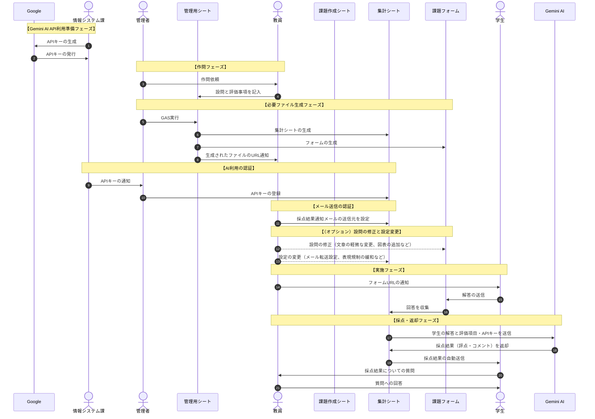

# AIScoring

# 実行に当たって必要なもの
* Google アカウント  
※ 所属機関がGoogle Workspace for Educationの契約をしていて、教育用に独立のアカウントを取得していることを想定しています。  
る場合は、xxxx@google.comのメールアドレスを保有していなくても、所属期間の発行するメールアカウントで利用できます。

* Gemini AI API Key  
※ [AI Studio](https://aistudio.google.com/)で発行できるキーになります。保有していない方は、[こちら]()を参照してAPIキーを取得し、保存しておいてください。途中のステップで必要になります。  
無償版でも利用可能ですが、１日の使用上限が少ないので、
WorkSpaceだと、そもそも無償版(Free Tier)がないので、Tier 1相当以上での利用が
※ 所属機関や部署単位で契約・管理する場合は、APIキーが利用できるように担当者と相談の上でご使用ください。  

# 運用について  
## ワークフロー

## 各作業単位の説明
上図のように、大きく三つの作業単位での運用を想定しています。  

- ### AI関連担当（情報システム課など）
【主な作業】  
  Gemini AIの契約とAPIキーの管理

- ### 課題管理担当（教務課など）
【主な作業】  
  課題の作問依頼や、API使用のための認証、学生への課題公示の管理など

- ### 作問担当（教員など）
【主な作業】  
  作問と評価項目の設定、学生からの質疑応答など  
  
括弧内は、大学組織内で分業する場合の担当者/部署の一例です。実際の運用は、

教育者が個人単位で全ての作業を運用することも可能です。この手の作業に慣れていれば、むしろ複数人で分業するより、１人で管理したほうが早く処理できます。  

### 必要なもの

* 

* Gemini AI APIキー

# 使用方法
## Gemini AIの契約、およびAPIキーの管理担当 (所属組織の情報システム課など)
Gemini AI APIはAI

## 作問担当（教員など）

## **AI API管理者**
1. 課題管理者にAPIキー

1. 

## **課題の管理部署（管理者）**
1. 課題管理用の[テンプレートファイル]()を、コピーして保存してください。  
  
1. 

## **作問者（教員など）**
* ### 作問
1. **課題管理者**に提示されたスプレッドシートに必要事項を入力する

|課題ID|担当者|担当者メールアドレス|タイトル|||
|--|--|--|--|--|--|
|（自動で入力されるので記入不要）|XXX|xxx@yy.zzz|課題タイトル 生成されるフォーム名やに反映されるので、講義名やシラバス上でのIDを付加するなどして、他と混同しにくいタイトルにすること！|||

2. 入力が完了したら、上段メニューから「教員用」>「設問完了」を選ぶ

* タイトル：下で  

* 問題数

* 問題文：
　※設問に画像を添付したい場合、この段階で対応する(\*1)か、
　　後で生成される**Googleフォームを直接編集して添付することも可能**です。  

* 評価事項  
  どんな事項が記述されていれば評価対象とするか、あるいは配点の指定などを記入してください。  
  経験的にルーブリック形式にするか、細かく加点/減点の条件を記載すると、再現性の高い採点が可能です。  
  例：○○についての記述が正しければ3点。□□が書けていれば+1点。△△という単語を使用していないと-1点、上限は5点で下限は0点 etc...  
  
### 2. 各URLの取得  
  **課題管理者**が処理を終えると、Googleフォーム（以下『課題フォーム』）と、集計用スプレッドシート（以下『スコアシート』）が生成され、担当者のアドレス宛にメールで通知されます。通知メールには下記の３つのリンクが記載されています。  

  - 『課題フォーム』の編集用リンク  
  - 『スコアシート』の編集用リンク  
  - 学生に提示する《回答用フォームURL》  

#### 2-1. (オプション) 生成された『課題フォーム』のチェック  
  通知されたリンクを開くと、実際の課題の表示をチェックできます。設問文の軽微な編集・修正も可能です。  
  このステップで課題に図表を付け足す場合は、  
  ※ 問題数の増減を伴う修正が必要な場合は、課題管理者に連絡して、新しく問題を再作成してください。  
  
#### 2-2. (オプション) テストデータの送信  
  学生向けの《回答用フォームURL》から、実際に回答を入力して送信することで、動作チェックが可能です。  

#### 2-3. (オプション) 生成された『スコアシート』のチェック
  学生からの回答、採点結果()
  
  また、スコアシート内の"info"シートを編集することで、いくつかの設定変更が可能です。  
    
  - メールの転送設定：「メール転送する」を選ぶと、学生に送信される【評価メール】を、指定したメールアドレスに転送できます。  

  - 次のアドレスへ転送：上で「メール転送する」を選んだ場合は、転送先アドレスを入力してください。「メール転送する」を選んでも、有効なメールアドレスが指定されていないと、転送されないので注意してください。  
  複数のアドレスを入力する場合は、カンマ区切りでアドレスを連ねてください。指定されたアドレスはbcc扱いになります。  
  - 
  - 表現規制の緩和：科目によっては規制対象に引っかかるケースが想定されます。現行バージョンでは、教員側が規制をオフに設定可能です。  
  例：医学部における、人体解剖、致死性の高い毒物や病原菌の詳細、生殖器の生理学など。  
  ※今後のGoogle Geminiのポリシーによっては、この設定項目は廃止になる可能性があります。  

## 課題管理者
### 学生へ公示
  教員、あるいは課題管理者が適切なタイミングで、学生に《回答用フォームURL》を提示して回答を促してください。  
  以後回答を締め切るまで、学生の回答に対してAIが採点しメールで結果を送信するプログラムが作動し続けます。

### 回答の締め切り
  

1. 公開されているテスト情報入力用の[テンプレートファイル]()を、自身のGoogleDriveにコピーしてください。  
\* 円滑な管理のため、専用のディレクトリを作成して、その中にコピーすることを推奨します。  

1. コピーした「テスト情報入力用シート」を開いて、タイトル、および問題と評価項目を入力してください。  

1. 上段のメニューバーから「テスト管理」 > 「フォームとスコアシートの生成」を選択してください。  
  各問題ごとに２つのファイル（Google FormとSpread sheet）が生成されます。  
  ※２つのファイルは、互いにリンクされた状態で生成されます。もし削除して作り直したい場合は、両方のファイルとも削除してから、あらためて「テスト情報入力用シート」に新しい行を追加して生成してください。

1. 生成されたフォームを開くと、実際の問題の表示をチェックできます。軽微な問題文の編集・修正も可能です。  
  問題数の増減を伴う修正が必要な場合は、一度削除して「テスト情報入力用シート」に新しい行を追加し、スコアシートごと再生成してください。　　

1. 生成されたスコアシートを開いて、認証します。まず、上部メニューから「」>「」

1. Open the created scoring sheet and select "" > "" menu to authorize your account.
During this step, you need to enter your Gemini AI API key for automatic scoring by AI.

1. 続いて上部メニューから「」 > 「」を選択して、自動メール送信のための認証をしてください。  
  採点済メールを一定間隔で自動で学生に送信するために必要です。  
  \* AI使用の認証と、メール送信の認証は別々のステップになっています。これは、AI使用アカウントを機関・部署単位で管理し、学生にテスト結果を送信するアカウントは教員ごとに管理する、といった使用状況が想定されたためです。　　
  \* この場合、１回目の認証は機関・部署の管理者に実行してもらい、２回目の認証は教員ごとに実行する必要があります。

1. 最初に使用した、「テスト情報入力用シート」内の「」シートにある、学生

# 日本の大学におけるワークフロー例（アクティビティ図）

# サンプルとデモムービー
## 個人単位で全行程を実行する場合

## 個人単位で全行程を実行する場合
### 【必要なもの】
- Googleアカウント
  
- Gemini APIキー
  
- 課題シートのテンプレート
  

- 

### 【デモムービー】
- 

# 制限

# 引用
投稿準備中