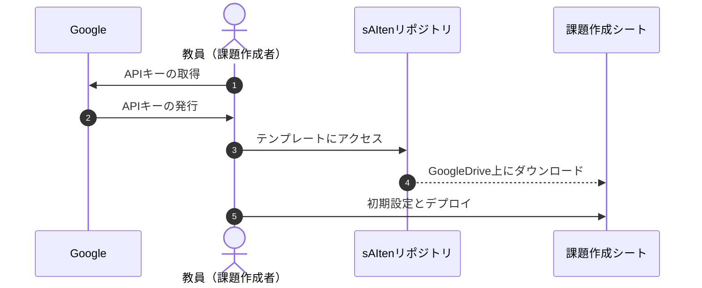
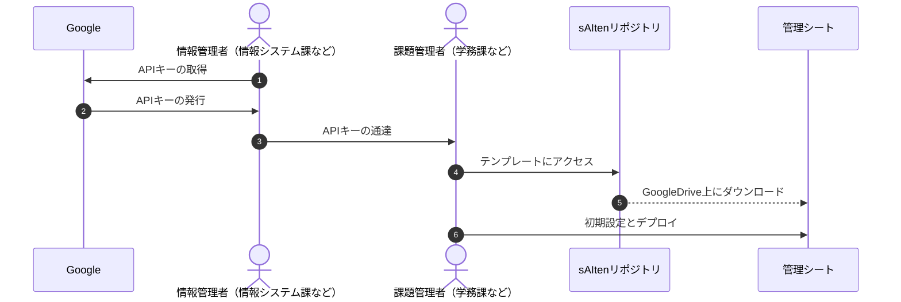
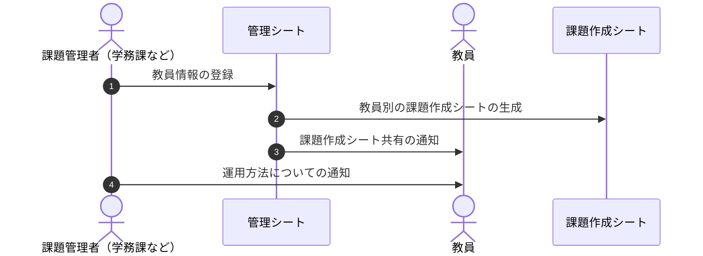
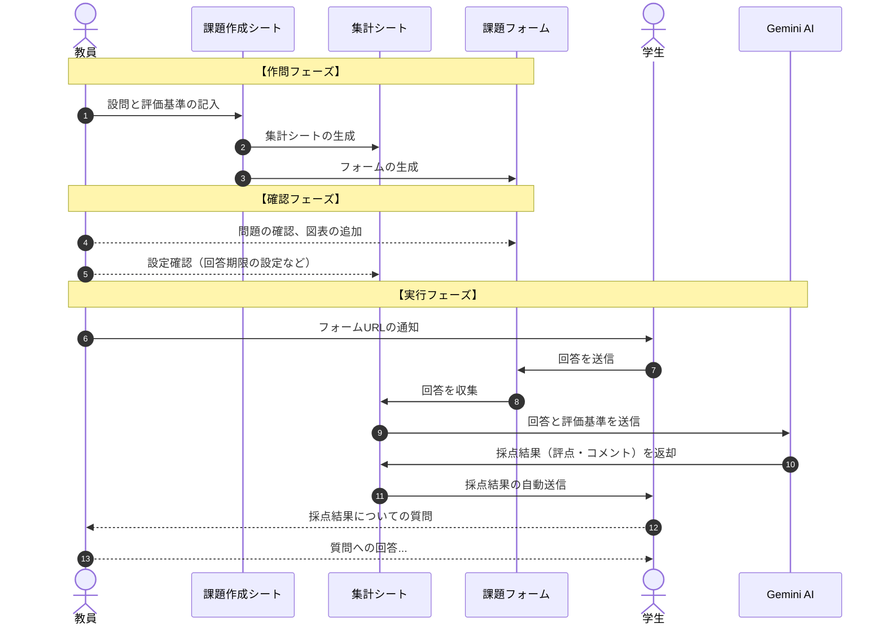

# sAIten
このリポジトリは、Google Spreadsheet と Google フォームを利用して、記述式の小テストを出題し、AIによる採点とスコア・コメントの返却までを自動かつ即時に行うためのファイルおよびスクリプトをまとめたものです。  
  
主な目的は、及落に関わるような重要試験ではなく、日常的な理解度を確認するための小規模な記述式テストを、教員の負担を抑えながら円滑に実施できるようにすることです。  

# 背景と利用例
大学などでは、学生数が教員に比べて多いと記述式問題の採点が負担になり、やむを得ず多肢選択問題のみを実施しているケースも少なくありません。  
しかし特定の事柄にまつわる知識の定着具合、理解の深度、あるいは説明能力など、記述式問題を課すことで量れる部分もあります。  
本システムを使えば、教員は問題文と評価基準（＝理解しておくべきポイントと配点）をスプレッドシートに入力するだけで、簡単に記述式テストを実施し、学生にフィードバックを返すことができます。  
もちろん、AIの採点結果をそのまま学生に返さずに、教員が内容を確認してから返却するよう設定することも可能です。  
  
また、2026年現在では学生がAIを利用して「それらしい」文章を生成することは、もはや珍しいことではありません。このため、一定の準備期間を与えて提出されたレポートなどからは、学生が真に理解しているのか？適切な説明能力を有するのか？といった評価をすることが難しくなってきています。  
本システムを使用することで、例えば講義中の５分ほどの短い時間を使い、教員は日常的に学生の学習進捗を確認することが可能になります。  
さらに、稼働期間の設定次第では、定期考査前などに学生が自らの理解度を復習・チェックできる、簡易演習システムとしても利用できます。  

# 実行に当たって必要なもの
* Google アカウント  
取得方法は[こちら](https://support.google.com/accounts/answer/27441?hl=ja&co=GENIE.Platform%3DDesktop&oco=0)  
※ 所属機関がGoogle Workspace for Educationの契約をしている場合は、xxxx@gmail.comのメールアドレスを保有していなくても、所属期間の発行するメールアカウントで利用できます。  
  

* Gemini API Key  
[AI Studio](https://aistudio.google.com/)で発行できるキーになります。  
保有していない場合は、[ガイダンス](https://ai.google.dev/gemini-api/docs/api-key?hl=ja)を参照してAPIキーを取得し、保存してください。  
※ 無償版(Free Tier)でも利用可能ですが、１日の使用上限が少ないので、支払い情報を登録して利用する（Tier 1 以上）ことを推奨します。  
ここでは詳細は省きますが、Google Cloudの無償利用権などを駆使すれば、支払い情報を登録しても負担ゼロで一定期間運用することが可能です。　　
※ WorkSpaceを契約している場合は無償版(Free Tier)がないので、所属機関・部署の管理者と相談の上でご使用ください。  

# 運用について  
## ワークフロー例
---  
### 導入編（個人運用の場合）

---
### 導入編（組織運用の場合）

---
### 中間管理（組織運用の場合）

---

### 実施編（共通）

---
  

# 使用方法
### 1. Gemini AIのAPIキーの取得と管理
AIを自動で利用するために、APIを利用します。このときにAPIの利用資格を証明するのがAPIキーです。  
個人用Googleアカウントの保有者は無料で作成できます。  
WorkSpace契約の場合、キーの作成自体は無料ですが、APIの使用段階で支払い情報の登録必須になります。  

### 2-1. 個人で運用する場合
### 2-1-1.  **【課題作成シート】** のダウンロード
[テンプレートファイル]()を開いて、「ファイル」メニューから「コピーを作成」を選び、自アカウントのGoogle Driveに保存してください。　　

### 2-1-2.  **【課題作成シート】** の初期設定と認証
  「sAIten」メニューから「設定」>「初期設定」を選んでください。  
  ※表示されない場合は初期設定が完了済です。
  
  表示されるダイアログに課題作成者の氏名を入力してください。  
  最後に認証を求められるので、Googleアカウントでログインして認証をしてください。  
  初期設定が完了するとメールが送信されます。  

### 2-1-3. Gemini APIキーの設定
  「sAIten」メニューから「設定」>「APIキーの設定」を選んでください。  
  
  表示されるダイアログにAPIキーを入力してください。  
  テスト用の通信が発生し、API経由でGemini AIにアクセスします。  
  結果がメールで通知されるます。失敗した場合は、正しいAPIキーを入力したか、もう１度よく見直して再設定を試みてください。  

### 2-1-4. デプロイ
  「sAIten」メニューから「設定」>「デプロイ」を選んでください。  

  複数課題で一括して自動採点、自動メール送信を行うための機能をアクティブにする作業が必要になります。  
  表示されるガイダンスに従ってリンクをクリックして、WebAppとして「デプロイ」を完了してください。  
  完了後、元のシート画面で「チェック」ボタンを押して、「OK」と表示されれば導入フェーズが終了です。  

## 2-2. 組織単位で運用する場合
## 2-2-1. **【課題管理シート】** のダウンロード
[テンプレートファイル]()を開いて、「ファイル」メニューから「コピーを作成」を選び、自アカウントのGoogle Driveに保存してください。　　

## 2-2-2. **【課題管理シート】** の初期設定と認証
## 2-2-3. Gemini APIキーの設定
## 2-2-4. デプロイ
スプレッドシートの外観は異なりますが、操作内容は 個人運用の 2-1-2 ～ 2-1-4 とほぼ同じです。  

## 2-2-5. 教員情報の入力
「教員リスト」に、課題作成を担当する教員のID、氏名、連絡先を入力してください。  

- ### 連絡先：
  Google Workspaceを契約している場合は、所属組織が発行したメールアドレスを入力してください。  
  そうでなければ、Googleアカウントを別途取得して、Gmailアドレスを入力してください。

## 2-2-6. 課題作成シートの生成と教員への通知
「sAIten」メニューから「課題作成シートの生成」を選ぶと、まだシートの生成されていない教員用のシートが生成されます。  
各教員アカウントに、編集権限つきでファイルが共有されます。このさい、生成したシートのアドレスは自動で教員アカウント宛に通達されます。  

## 3. 作問と評価方法の設定

**【課題作成シート】** の『作問用シート』に、必要事項を入力してください。  
１行につき１課題として扱い、それぞれ課題ごとに Googleフォームと集計シートが生成されます。  
各行に必要な情報を入力してください。  
  
|課題ID (非表示)|課題タイトル|問題数|Q.1 問題文|Q.1 評価基準|Q.1 添付図表|Q.1 必須回答の設定|Q.2 ...|
|--|--|--|--|--|--|--|--|
|（自動入力）|フォームの主題|半角数字|問題の設問文|評価基準|任意設定|デフォルトは 回答必須|以下、問題数分だけ繰り返し|
  
- ### 課題タイトル：
  課題タイトルは生成されるフォームのタイトルや名称に反映されます。  
  講義名とナンバリング、あるいはシラバス上でのIDを付加するなどして、混同しにくいタイトルにしてください。　　

- ### 問題数：
  問題数を入力してください。  
  少しタイムラグがありますが、入力するべきセルとそうでないセルが色分けされます。    
  データ通信量と時間的制約の都合上、１課題あたりの問題数には上限が設定されています（デフォルトでは最大10問）。  
  この最大問題数は「設定」から変更可能です。学生数や課題数、AIの使用量によって適正な数値に再設定できます。  

- ### 問題文：
  提示する問題の設問文です。  
  
- ### 評価基準：
  AIで採点する場合の評価基準です。  
  「満点10点で採点して」などの大雑把な命令でも採点されますが、AI回答の精度（同じ答案への得点・コメントの再現性）が低くなります。  
   具体的な得失点例を記載したり、評価事項と段階的な得点基準を記載（ルーブリック表のイメージ）することを推奨します。これにより、AIの採点結果が安定するだけでなく、回答中の高評価ポイントや減点ポイントが、コメントに明瞭に反映されて学生（回答者）に送信されます。  
    
  例：  
  「○○について、△△の説明が書けていれば3点、□□の記載が抜けていたら1点」  
  「××の数値が誤っていたら-2点」など
   
- ### 添付図表：
  Googleフォームには、問題１つにつき１つの画像が添付できます。画像がGoogle Drive内にある場合は、ここで添付画像を指定することができます。  
  このタイミングで画像を指定しなかったとしても、後で生成されたフォームを直接編集して画像を添付することも可能です。  

- ### 必須回答の設定：
  回答を必須にするか任意にするか選択できます。デフォルトでは「必須」になります。  
  複数の問題から何問か回答すれば良い、といった形式で運用する場合は適宜「任意」に再設定してください。  
  
## 4. フォームと集計シートの生成
メニューから「sAIten」>「フォームと集計シートの生成」を選択してください。  
回答用のGoogleフォームファイル、および集計シートが生成され、「生成済ファイル一覧」シートが開きます。  

|課題ID (非表示)|課題タイトル|課題フォーム|集計シート|回答用フォームURL|公開|
|--|--|--|--|--|--|
|（自動入力）|フォームの主題名|生成されたGoogleフォームへのリンク|生成された集計シートへのリンク|フォームに回答するためのURL|公開状況|
  
- ### 課題フォーム：
  生成後に軽微な編集が可能です。問題文の誤字脱字の修正や、画像の貼付はこのタイミングで直接フォーム上で実行してください。  
  ※ 問題数の変更は出来ないので、もし変更したい場合は一度破棄してから、再度課題の入力と生成を行ってください。　
  ※ 最終的な問題数の変更がなくても一度問題を削除して新規作成する場合、同様に課題の再生成をしないと上手く作動しなくなりますので、ご注意ください。  

- ### 集計シート：
  主にフォームからの回答と、AIからのレスポンスを記録するためのシートですが、回答に関する課題ごとの設定も可能です。  
  課題作成シートでは全課題共通の設定しかできませんが、こちらのファイルでは当該課題に固有の設定ができます。  
  例えば、回答期限を短くして一定時間内に回答させる、回答回数を１回にして実力テスト風の実施形態をとる、といったことも出来ます。  
  
- ### 回答用フォームURL：
  学生（回答者）に提示する、回答用のURLです。  
  デジタル資料にリンクを埋め込んだり、QRコード化してスライド表示、印刷媒体に載せるなどして、提示してください。  

- ### 公開状態：
  ファイル生成直後から「公開中」になります。  
  「公開中」でも、【集計シート】側の方で回答期限などに制限をかけている場合、AIの採点や結果通知は行われません。  
  手動で「停止」に変更すれば、フォームの公開そのものが停止します。  

## 5. 実行
《回答用フォームURL》のURLを学生に提示してください。  

以後は、回答受付条件が満たされている間、指定したタイミングでAIが採点し、メールで結果を送信するプログラムが作動し続けます。  
回答の締め切り、採点のタイミング（学生が回答送信直後、あるいは一定の時間間隔）などに関する設定は、いずれもスプレッドシート上で任意に変更できます。  
  
  
### サンプルとデモムービー
- 

# 引用
投稿準備中